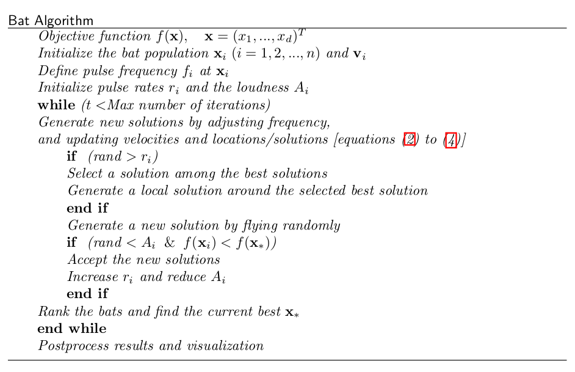
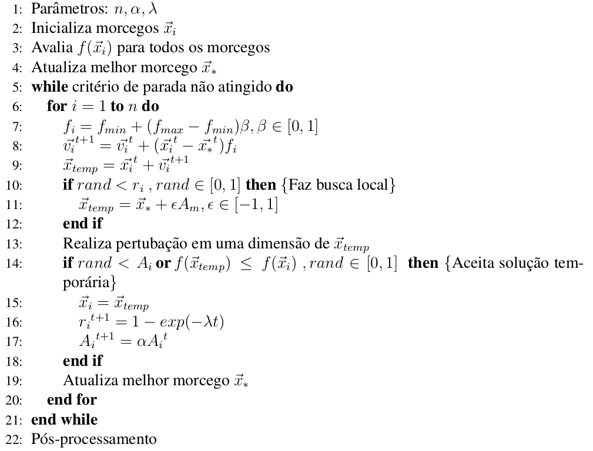
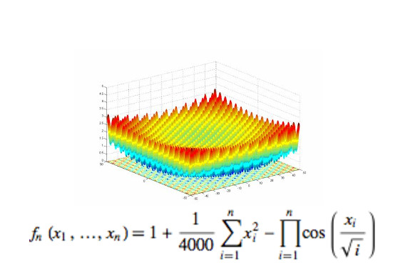
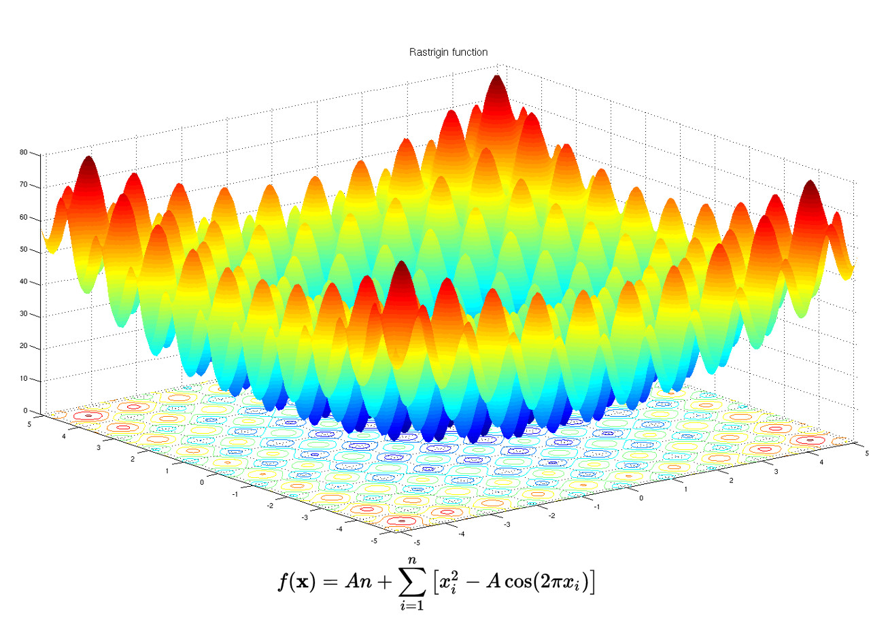
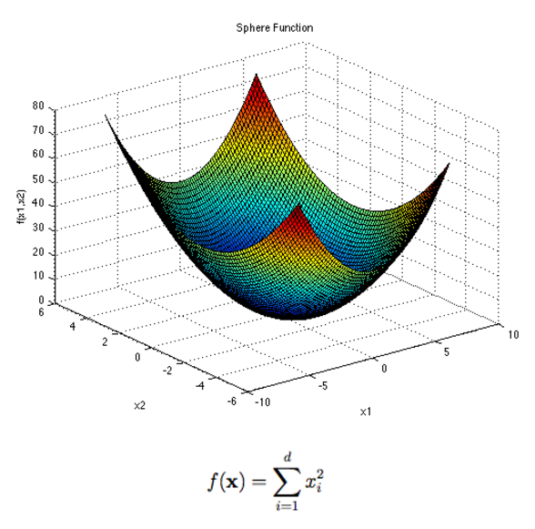

Morcego em GPU
==============

Contextualização
----------------

Aplicar o algorítmo do morcego em GPU.

C CUDA na Amazon.

### Variáveis:

- Frequência: proporcional a intensificação
- Amplitude: proporcional a diversificação
- Posição infuenciada pela amplitude

### Como?

Primeiramente separar a população paralelamente (DAO, 2015).

Em um segundo passo tornar o processo de varredura paralelo?

Algoritmos em GPU
-----------------

- Sim: Bactérias
- Sim: Busca da harmonia
- Sim: Celular automata
- Sim: Computação de membrana
- Sim: Cuco
- Sim: Formiga (ACO)
- Sim: Genéticos
- Sim: Morcego
- Sim: Partículas (PSO)
- Sim: Procura por alimentos de abelhas (Bee foraging)
- Sim: Pulo do Sapo
- Sim: Redes Neurais
- Sim: Vaga-lume (Firefly)
- Sim: Acasalamento de abelhas (Bee mating)
- Sim: Braimstorming process
- Sim: CMAE-
- Não: Tubarão (Não foi adotado pela comunidade)
- Não: Vespa (Não foi adotado pela comunidade)
- Não: Infestação de baratas
- Não: Mosquito
- Não: Polinização de Flores NC 
- Não: Sistema Imunológico Artificial
- Não: Slime mould

Modelagem matemática
====================

Pseudo Código Original
----------------------

Pseudo Código Jelson's
-----------------------

Benchmarks
==========

Funções de Benchmarks
--------------------

- Ackley
- Griewank
- Rastrigin
- Sphere

Ackley
------

Griewank
--------

Rastrigin
--------

Sphere
------

Benchmarks Yang's 2010
----------------------

- Ackley
- De Jong
- Easoms
- Eggcrate
- Griewank
- Michalewicz
- Rastrigin
- Rosenbrocks
- Schewefels
- Schuberts

Benchmarks Jelson's
-------------------

- Ackley
- Griewank
- Rastrigin
- Sphere

Benchmarks Adis
---------------

- Ackley
- Griewank
- Rastrigin
- Rosenbrok
- Sphere

Benchmarks Li
-------------

- Ackley
- Eliptic
- Rastrigin
- Rosenbrocks
- Schwefel
- Sphere

Referências
-----------

 - Bat Algorithm: An Overview and it's Applicaions, S Induja,
International Journal of Advanced Research in Computer and
Communication Engineering, 2016

- A New Metaheuristics Bat-Inspired Algorithm, Xin-She Yang,
Department of Engineering, Cambridge, 2010

- Análise de Sensibilidade dos Parâmetros do Bat Algorithm e
Comparação de Desempenho, Jelson A. Cordeiro, Rafael Stubs
Parpinelli, Heitor Silvério Lopes

- Parallel bat algorithm for optimizing makespan in job scheduling
problems, Thi-Kien Dao, Tien-Szu Pan, Trong-The Nguyen,
Jeng-Shyang Pan,2015, Springer Sience Review

- Improved Hibridized Bat algorithm for Global Numerical
Optimization, Adis Alihodzic, Milan Tuba, 2014, International
Conference on Computer Modeling and simulation

- Benchmark Functions for the CEC'2013 Special Session and
Competition on Large-Scale Global Optimization, Xiaodong Li, Ke
Tang, Mohammad N. Omidvar, Zhenyu Yang, Kai Qin, 2013

