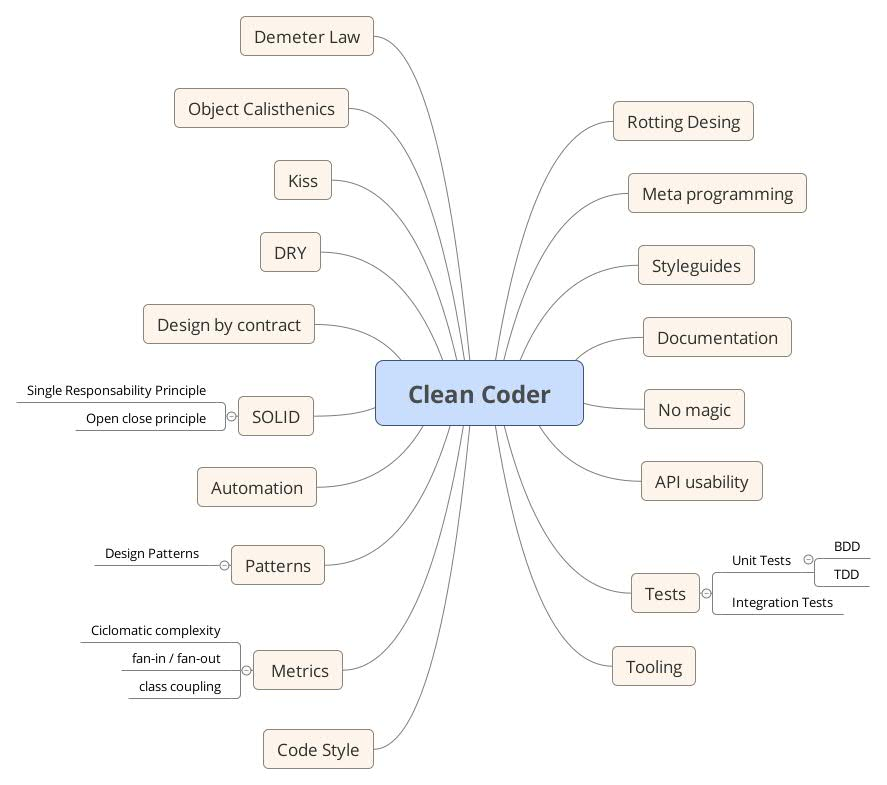

All about Clean Code
--------------------

> There’s no problem so simple that a bad developer can’t make it complicated.

Steve Bohlen

> Programming is the art of telling another human what one wants the computer to do.

Donald Knuth

What Clean Code stands for?
---------------------------

Clean code is a reader-focused development style that produces software that's easy to:

- write
- read
- maintain

Why it matters?
---------------

### [Broken windows theory](https://en.wikipedia.org/wiki/Broken_windows_theory)

One *broken window* is all it takes to start the decline.

"All the rest of this code is crap, I'll just follow suit."

Software entropy, software rot.

Why it matters?
------------


The four characteristics of Rotting software
--------------------------------------------

- Rigidity
- Fragility
- Immobility
- Viscosity

From the book *Design Principles and Design Patterns* de *Robert C. Martins*

Rotting software 1 - Rigidity
-----------------------------

It's hard to solve simple problems.

No one knows how long will take to solve them.

Estimating is hard.

Rotting software 2 - Fragility
------------------------------

The software breaks too often.

A change in one unrelated part breaks others.

Changes must be echoed in many places.

Rotting software 3 - Immobility
-------------------------------

It's the inability of reusing software from other places.

Rotting software 4 - Viscosity
------------------------------

It's easier to go to the *hacking mode* than to the *design preservation* mode.

Implications
------------

Software rot implies in frustrated developers.

Frustrated developers implies in more rotting.

Too much rooting implies in system rewrite.

Loss of money.

Loss of users.

## Solution?

- Good practices
- Software craftsmanship
- Clean code

> Anyone can write code a computer can understand, but only professional developers write code *humans* can understand.

Clean coder skills
------------------



Recommendations
---------------

> Relatively simple things can tolerate a certain level of
disorganization. However, as complexity increases, disorganization
becomes suicidal.  Robert Martin

Follow the ones what suites you most.

> Dear truth always deceiving simplicity.  John Green

<!-- Use Difficulty progression? -->

SOLID
-----

Or the "first five principles" by Michael Feathers.

To make systems that are: is easy to maintain and extend over time

Single Responsibility Principle (SRP)
-------------------------------------

If you can think of more than one motive for changing a class, then that class has more than one responsibility.

```php
<?php
interface UserInterface
{
    public function setId($id);
    public function getId();
    public function setName($name);
    public function getName();
    public function findById($id);
    public function insert();
    public function update();
    public function delete();
}
```

Open Close Principle (OC)
----------

The interface is closed to modification - and new implementation must, at least, implement that interface.

Liskov substitution (LS)
-------------------

It's possible to change subclasses without breaking the program.

Interface segregation Principle (ISP)
---------------------

It's better more interfaces than less.

Clients should not be forced to depend upon interfaces that they don't use.

```php
abstract class AbstractPostgreSQLDriver implements
Driver,
ExceptionConverterDriver,
VersionAwarePlatformDriver
```

Dependency inversion
--------------------

One should depend only on abstractions.

### For PHP:

- https://github.com/container-interop/container-interop
- https://github.com/auraphp/Aura.Dio
- https://github.com/zendframework/zend-servicemanager

DRY
---

Don't Repeat Yourself

```php
/**
*
* @param $title The title of the CD
* @param $author The author of the CD
* @param $tracks The number of tracks of the CD
*
*/
public addCd($title, $author, int $tracks);
```

Dry on documentation
--------------------

Code and documentation are different views of the same underlying model.

Two places to edit models? DRY violation.

[zendframework/ZendDeveloperTools generates diagrams of entities](https://github.com/zendframework/ZendDeveloperTools/blob/master/README.md)

Orthogonality
-------------

Two or more things are *orthogonal* if changes in one do not
affect any of the others.

### Benefits of Orthogonal Systems

- Eliminate effects between unrelated things
- Changes are localized
- Promotes reuse
- Disease sections of code are isolated
- The result system is less fragile
- Better tested
- Not tightly to a particular vendor

Law of Demeter
--------------

You don't ever, ever play with your toy's toys.

If you need to change an object's state, get the object to do it for you.

Any method of an object should call only methods belonging to:

- itself;
- any parameters received;
- any objects it creates and any directly held component objects.

Really important for testing.

Composite Reuse
---------------

One should build upon interfaces.

> OO languages replace function pointers with convenient polymorphism.
Robert C. Martin


### Benefits

- Easier to maintain (no unexpected behaviors)
- Performance gain
- The inversion of source code and run time dependencies

Design by contract
------------------

> Objects collaborate with each other on the basis of "mutual obligations and benefits".
 Bertrand Meyer

Developing became the process of honoring contracts.

Accept few and promise few.

Functions Arguments
-------------------

The ideal number of arguments of a function is ZERO.

More than tree is unacceptable.

### Flags

Flag arguments are ugly.
They state a SRP violation.


```php
public function useResultCache($bool, $lifetime = null/**...**/)
{
    if ($bool) {
        $this->setResultCacheLifetime($lifetime);
        $this->setResultCacheId($resultCacheId);

        return $this;
    }
    //...
}

```


Function Returns
----------------

Output from function is not so good as well.
If functions must change a thing it must change itself.

Comments
--------

### Usage scenarios

Put in the dock block at least the authors name.

Comments serves as well to discuss the purpose and trade-offs of implementations.

### Avoid scenarios

The usual aim of comments is to express the code.

So, if they are necessary there's a grand chance that the design smells.

Inaccurate comments are way worse than no comments at all.


Classes - Journal Metaphor (SRP)
--------------------------------

Classes should be like journal articles.

In the header you get an general overview. 

You are able to decide if you go further or not.

As you read down details increases.

A journal is made of many little articles.


Objects vs Data structures
--------------------------

In any good system the distinction of data structures and objects is clear.

Objects hide data and expose operations over it.

Data structures expose data and have no meaningful operation.

Naming
------

Long names are generally better than small names.

Need to see the source for to know what a function does? Work on names!

If there's an ``And`` in a function name it's violating SRP.

Complex operations can be made simple when intermediate variables are used.

``testBuild_PRedBCWithDifference_whenCSOSN900AndICMSLessThan100Percent``


Many little classes vs Few big ones
-----------------------------------

Some fear to have to browser in many files till find the right piece of code.

Many classes does not imply in comprehension damage.

The Many and the Few approaches both have the same amount of business logic to care of.

So the question is:

**You prefer your tools being organized in boxes with little compartments and good names?**

**Or only a compartment and all inside?**

Many little classes are always better than few big ones
-------------------------------------------------------

Any regular system will contain a vast quantity of logic

The first goal of managing complexity is organizing in a way developers know how to look for a certain thing, without having to worry about neighbour details.

We want our systems to have many little classes - not few big ones.

Relates to ISP.

Remove is better than adding
-----------------------------

Don't let existing code dictate future code.

Be ready to refactor.

It may impact project schedule.

The assumption is that the impact will be less than the cost of not making the change.

> Perfection is attained not when there is nothing more to add, but when there is nothing more to remove.
Antoine de Saint-Exupéry

Object Calisthenics
-------------------

Seven code qualities premisses:

- Cohesion
- Loose coupling
- No redundancy
- Encapsulation
- Testability
- Readability
- Focus


1 - One level of indentation per method
----------------------------------------

### Benefits

Finding bugs is much easier.

If you have more than one indentation level you have more than one abstraction level.

2 - Don't use ELSE keyword
---------------------------

Else's encourages the inclusion of more, intermediate, ifs.

When possible avoid even if's.

Use polymorphism instead.

3 - Wrap all primitives and Strings
------------------------------------

Small objects make programs more maintainable.

They serves as a container for logic that otherwise would be sparse.

4 - First class collections
---------------------------

Any class with a collection shouldn't contain other member variables.

5 - One dot per line
---------------------

Bad:

```php
this->myMemberObject
    ->myMemberObjectMemberObject
    ->doFoo();
```

Good:

```php
this->myMemberObjectMemberObject
    ->functionThatDoFooToo();
```

Relates to Law of Demeter

6 - Don't abbreviate
---------------------

Abbreviation because of exhaustive use?

DRY violation.

Too long names?

Maybe a SRP problem.

7 - Keep all entities small
----------------------------

No classes over 50 lines and no packages over 10 files.

8 - No classes with more than two instance variables.
-----------------------------------------------------

A class *Name* with first, middle and last name might be decomposed to:
A class *Name* with a *Surname* class and a *GivenNames* class.

9 - No getters/setters/properties
---------------------------------

When you have the enough quantity of encapsulation provided from
the previous rules you will never need to do any operation on the
getters/setters.

Calisthenics Enforcer
---------------------

[PHPCS rules for OC: https://github.com/object-calisthenics/phpcs-calisthenics-rules](https://github.com/object-calisthenics/phpcs-calisthenics-rules)

Tests
-----

Testing code use different patterns than production code.

They have different constraints.

There things you will never do in production code that in testing code is allowed.

Like memory and performance things.

But never clarity things.

Tests is the best way of documenting the system usage.

No Magic
--------

Never buy magic.

Before you commit to a framework, make sure you could write it.

Do this by actually writing something simple that does the basics that you need.

Make sure the magic all goes away.


Three virtues of a programmer
-----------------------------

- Laziness: The quality that makes you go to great effort to reduce
overall energy expenditure. It makes you write labor-saving programs
that other people will find useful and document what you wrote so you
don't have to answer so many questions about it.

- Impatience: The anger you feel when the computer is being lazy. This
makes you write programs that don't just react to your needs, but
actually anticipate them. Or at least pretend to.

- Hubris: The quality that makes you write (and maintain) programs that
other people won't want to say bad things about.


Larry Wall

Style Guides
-----------

Follow a coding standard, no matter which, but all the code must follow the chosen one.

### Examples for PHP

- PSR2
- Zend
- Symphony

KISS
----

Simplicity is different of easy.


> UNIX is very simple, it just needs a genius to understand it's
simplicity. Dennis Ritchie


Measure
-------

Nice things to measure:

- Ciclomatic complexity;
- Inheritance fan-in (number of base classes);
- Inheritance fan-out (number of derived modules using this one as parent);
- Class coupling ratios

PHP7 for the clean coder
------------------------

Anonymous classes as a way of mocking.


Tools
-----

- Codacy: https://www.codacy.com/

- PHP refactoring toolbox: https://github.com/adoy/vim-php-refactoring-toolbox

Literature
----------

> Those who do not remember the past are condemned to repeat it.

Jorge Agustin Nicolas Ruiz de Santayana y Borras

1. Clean code: A hand book of Agile Software craftsmanship; Robert C. Martin
2. The pragmatical programmer; Andrew Hunt
3. Code Complete; Steve McConnell
4. Refactoring: Improving the Design of Existing Code;
5. Release It!: Design and Deploy Production-Ready Software; Michael T. Nygard

Plural sight course

http://app.pluralsight.com/courses/writing-clean-code-humans


Conclusion
----------

> Quality is a team issue.  Andy hunt.

Teams as a hole should not tolerate broken windows.


Clean code is not about perfection.. It's about honesty.

We made our best to leave the camp cleaner than we find it?


Conclusion
----------

But if we aim for the 80% where code needs the most. We are cool.

Parts not critical to performance must be clean - not optimized.

> The best programmers are 28 times best than the worst ones.
Robert Glass, [Facts and Fallacies of Software Engineering](http://www.amazon.com/Facts-Fallacies-Software-Engineering-Robert/dp/0321117425)


There's always room for improvement.


Thanks. Questions?
------------------

Contact info: contato@jeancarlomachado.com.br
