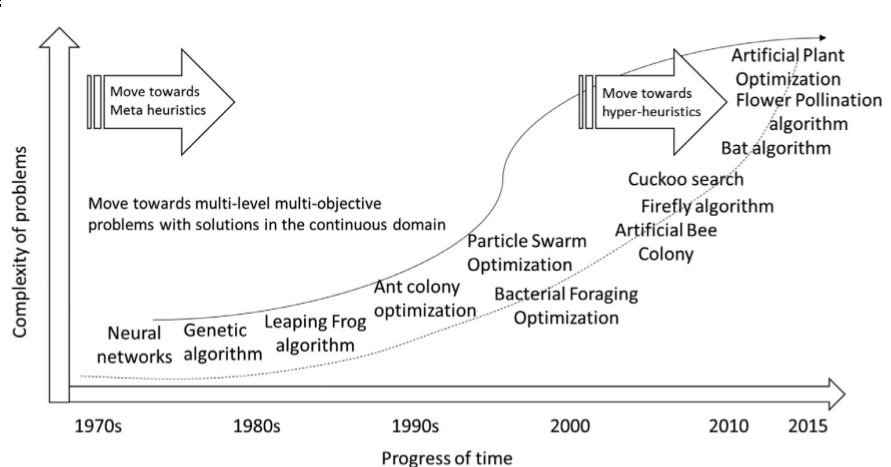
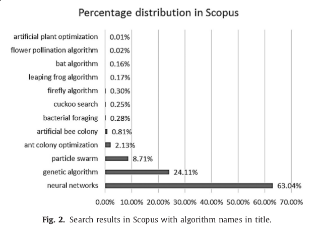

## Revisão de artigos 2

Jean Carlo Machado e Renato Bustamante

## Artigos

 - Iztok Fister Jr., Xin-She Yang - A Brief Review of Nature-Inspired Algorithms
for Optimization, University of Maribor, 2000

 - Arpan Kumar Kar, 2016, io inspired computing - A review of algorithms
and scope of applications, Indian Institute of Technology

 - R. S. Parpinelli, H. S. Lopes, 2011, New inspierations in swarm intelligence: a survey, Int. J. Bio-Inspired Computation

## Tema geral

Comparativos entre algoritmos de otimização baseados na natureza.

## Popularidade de algoritmos

"A good balance between exploitation and exporation may lead to
the global optimally achievement."

Dentre os que tem bom balanço pode-se citar: PSO, evolução
diferencial, busca do cuco, algoritmos de vaga-lume.

Alguns bons algoritmos não foram adotados pela comunidade:
algoritmo de vespa e algoritmo do tubarão.

## Classificação

Existem várias forma de classificar algoritmos naturais

- Trajetória vs população

## Complexidades dos problemas pelo tempo

## Utilização de algoritmos na comunidade científica

# Algoritmos

## Algoritmos

- Abelhas
- Bactérias
- Cuco
- Flores
- Formiga
- Genéticos
- Morcego
- Partículas
- Redes Neurais
- Sapo
- Slime mould
- Vaga-lume

## Algoritmos de Abelha (2005)

Bom para resolver problemas evolucionários.

A intensificação é controlada por meios estocásticos e ávidos.

Tem melhor performance do que algoritmos de Monte Carlo, Genéticos
e ACO.

Já foram utilizados em alocação de tarefas e distribuição de
energia.

### Acasalamento de abelhas

tree-SAT problem optimization.

utilizado em programação estocástica e dinamica.

## Algoritmos Genéticos

São bons para problemas combinatórios e não determinísticos.

A eficiência para problemas com muitas dimensões tende a ser ruim.

Já foi aplicado em agendamento de trabalhos, compressão de dados,
gerenciamento econômico, teoria dos jogos, controle de
satélite,etc.

## Busca de alimentos bacterial

As bactérias se movem rotacionando-se e tombando.

O objetivo da busca de alimentos pode ser racionalizado como:
maximizar a entrada de energia por unidade de tempo procurando
alimento.

O algoritmo apresento baixa convergência em tarefas complexas.

## Algoritmos de formiga

O tempo de resposta é razoável.

## Salto do Sapo (2000)

Combina os benefícios de algoritmos sociais e meméticos. Bom para
encontrar ótimos locais predominantes.
Especialmente bom quando a função local está afetada por
ruídos locais.

## Busca do Cuco

Bom para problemas com restrições não lineares complexas.

## Algoritmos de Morcego (2010)

Serve para problemas contínuos.
Bom para otimizações com restrições

Utilizado apenas uma vez, para o problema do caixeiro viajante.

## Enxame de partículas (PSO)

Relativamente simples de implementar.
Foi utilizado em problemas de agendamento, e de
maximização/minimização.

## Polinização de flores

Bom para problemas de otimização global.

## Vaga-lume

Lida com funções multi modais mais eficientemente do que outros
algoritmos de enxame.

## Redes Neurais

A rede de perceptron é a implementação mais simples.
Pode ser utilizado para problemas lineares e não lineares.

## Slime mould

Foi aplicado apenas no artigo original

## Futuras pesquisas da CN

- Redução de parâmetros.
 
- Co evolução
 
- Novas inspirações

## Conclusão

O artigo de Arpan Kumar Kar pareceu ter sido feito por várias
pessoas, com pontos chave sendo feitos repetidamente, como se
recortados.

[[#]] Obrigado
