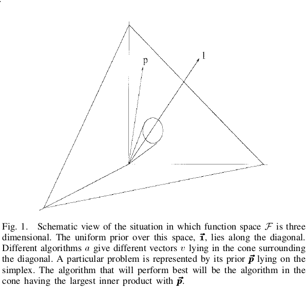

## Revisão de artigos 3

Jean Carlo Machado e Renato Bustamante

## Tema geral

Argumenta que muitas das novas inspirações estão tirando o rigor
científico da área de meta eurísticas.

Em novas inspirações, muitas vezes não há nenhuma contribuição
clara de conhecimento, é apenas uma troca de terminologia.

Reiteração de conhecimento existente.

Criam uma visão ruim da área de conhecimento.

## Exemplos de "novos" algoritmos:

- Pulo do sapo
- Refração da luz
- Fluxo de água até o mar
- Orquestra tocando
- Esperma indo fertilizar o óvulo
- Movimento das galáxias
- Morcegos
- Pássaros
- Formigas
- Abelhas
- Moscas

## "Novas inspirações são sempre melhores que os antigos"

- Não existe tanto foco em otimizar o antigo
- O ambiente é diferente
- Os testes de benchmark são limitados

## "Novas inspirações são sempre melhores que os antigos"

Não responde perguntas como:

- Qual é a qualidade da melhor solução encontrada?
- Quanto tempo leva para determinar a melhor solução?
- Quão rápido o algoritmo encontra boas soluções?
- Quão longo está a melhor solução em relação as mais facilmente
  encontradas?
- Vale á pena o uso desse algoritmo dada sua complexidade e
  soluções?

## Princípios da construção de heurísticas

- Analogia
- Indução - derivar generalização de alguns exemplos
- Problema auxiliar

Idealmente, o design de meta-heurísticas deveria analisar a
estrutura do problema e desenvolver métodos baseados nela.

## Princípios da construção de heurísticas

## Exemplos de meta-heurísticas consolidadas

- Busca tabu
- Algoritmos genéticos
- Simulated anneling

## Pesquisa a avançar em otimização

- Usar mais de uma estrutura para escapar de um ótimo local
- Utilizar randomização em heurísticas greedy
- Heurística piloto para calcular o custo e qualidade de heurísticas
- Achar o melhor algoritmo para a melhor classe de problema. 
- Conseguir identificar por que determinados
métodos se encaixam com determinadas heurísticas e outros não

## Conclusão

O assunto se relaciona com o teorema de "No-free-lunch" no sentido
de que os novos algoritmos propostos na maioria das vezes não
trazem benefícios reais para a área.

## Conclusão

A performance média de cada par de algoritmos entre todos os
problemas é idêntica (até mesmo busca aleatória).

Reforça-se a necessidade de uma seleção adequada de
meta-heurísticas para cada problema.

Ainda existe espaço para novas inspirações. Dado que existem
algoritmos "tradicionais" em diversas áreas que talvez não se
configurem a melhor forma de interagir com os problemas os quais a área
lida.

## Referências

- Metaheuristics - the metaphor exposed. Kenneth Sorensen, University of Antwerp, 2012 
- No Free Lunch Theorems for optimization. David H. Wolpert and Willian G. Macready, IEEE, 1997
- Design and Reporting on Computational Experiments with Heuristic Methods, Richar S. Barr et al, 1995
- New inspierations in swarm intelligence: a survey. R. S. Parpinelli and H. S. Lopes, 2011

# Obrigado

