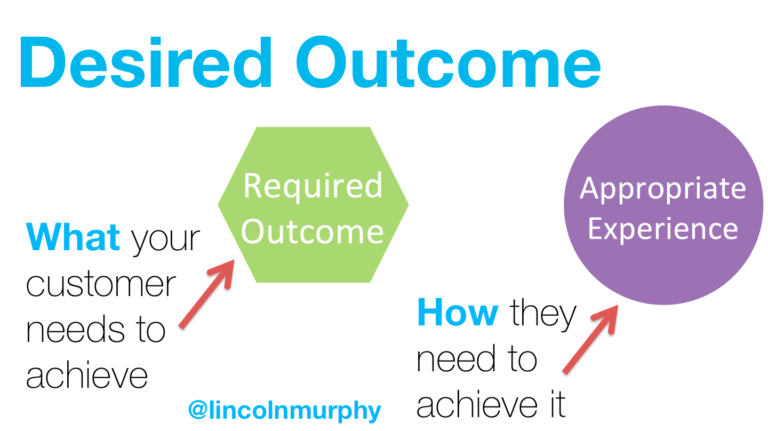
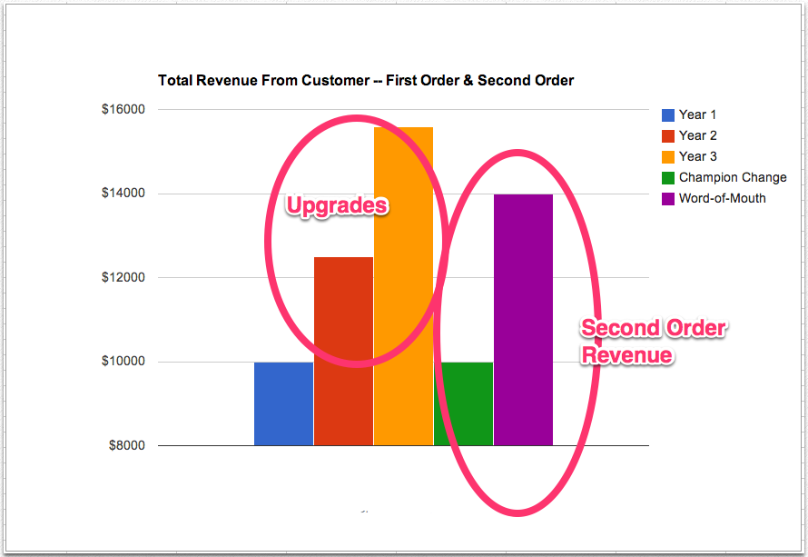

build-lists: true
autoscale: true

# O papel da revenda no modelo SaaS

[.footer: Elton Minetto - Jean Carlo Machado]

---

## O que é SaaS?

- Software se torna um serviço

- Em demanda

- Sem instalação

---

### Cases de sucesso

---

### Vantagens do SaaS

- Entrega contínua

- Suporte rápido

- Facilidade de acesso

- Portabilidade

- Upselling

- Integrabilidade

---

### Desafios

- 40-60 % dos usuários de SaaS usam os produtos apenas uma vez 

- É 7x mais caro conseguir um cliente novo do que manter um

- Não existe modelo consolidado de revendas

---

# CompuFácil

---

## Focos da empresa

### Parceiro

- Preços especiais
- Suporte especial
- Integrações e ferramentas 

---

### Plataforma de soluções

- Integrações a sistemas de terceiros
- Aplicativos próprios
- Aplicativos de terceiros

## Como a Compufácil pode ajudar a revenda

- Fornecendo dados sobre os clientes existentes e leads
- Fomentar um relacionamento com as revendas, mantendo-a informada das novas funcionalidades e metodologias
- Mantendo um canal aberto com a equipe de tecnologia para a resolução de problemas, sugestões de melhorias
podemos ajudar as revendas?
demos ajudar as revendas

---

# Quais são os papeis das revendas?

- Apresentar o sistema para um cliente (vender)
- Dar manutenção/educação, nutrir o relacionamento, a seus usuários no longo prazo (suporte)

---

# Fases do relacionamento com consumidores em SaaS

1. Atrair
2. Converter
3. Reter

---
 
## Atração

- O cliente precisa entender o problema
- A revenda precisa ser um educador
    1. Gestão financeira
    2. Varejo
    3. Gestão de pessoas

--- 

## Conversão

Faze de definição do resto do relacionamento, definido por:

- Qualidade do suporte
- Educação quanto a solução

*A frequência de retorno a um sistema é uma reflexão de quanto o
sistema vale para o usuário*

---

## Retenção

- Mentoria quanto ao uso do sistema

- Estar informado e informar sobre novas funcionalidades

- Rápida resolução de problemas

---

# Customer Success

É quando seus clientes atingem os objetivos deles através das
interações com sua empresa.

 - Não focar no produto, mas nas **interações**
 - Entende entender o que o cliente precisa atingir e ajudá-lo

---

## Foque em clientes com potencial

 - Fica mais tempo no produto
 - Compra mais
 - Te envolve em outras partes da empresa
 - Te recomenda publicamente

---

## Resultado esperado

---

É sua responsabilidade entender o resultado esperado do seu cliente
*melhor* que ele

Prover uma experiência que não fique no caminho

---

## Seja proativo

 - Treinamento do produto
 - Treinamento de negócio
 - Serviços especializados
 - Onboarding acompanhado
 - Dicas do aplicativo
 - Acompanhamento via e-mail

---

## Benefícios

A probabilidade de vender algo para um novo cliente é 5-20%. 

Para clientes existentes é 60-70%.

---

Focando em Customer Success grande parte da receita vem depois da venda (CLV)

---

# Links

1. [Guia SaaS](http://info.endeavor.org.br/ebook-gratuito-guia-saas)
2. [Understanding The SaaS Customer Lifecycle](https://www.cobloom.com/blog/understanding-the-saas-customer-lifecycle)
3. [Customer Success: o que é e o que você precisa saber](http://resultadosdigitais.com.br/blog/customer-success/)
4. [The SaaS Development Lifecycle](https://www.infoq.com/articles/SaaS-Lifecycle)
5. [How to Sell SaaS](https://link.springer.com/chapter/10.1007/978-3-642-21544-5_2)
6. [CLTV Isn’t The Whole Story. Don’t Shortchange Second-Order Revenue](https://www.saastr.com/it's-not-just-cltv-it's-your-trgcltv-that-matters-total-all-in-revenue-generated-by-your-customer/)
7. [Customer Success: The Definitive Guide 2017](http://sixteenventures.com/customer-success-definition)
8. [How to Use Upselling to Increase Customer Happiness, Retention
   and Revenue](https://www.groovehq.com/support/upsells)
9. [The SaaS Success Database](https://techcrunch.com/2015/08/29/the-saas-success-database/)

---

# [fit] CompuFácil

## http://compufacil.com.br
